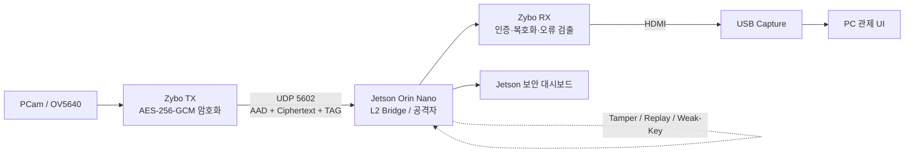

# FPGA AES-256-GCM 영상 보안 관제 시스템

Zybo Z7-20 FPGA에서 카메라 영상을 실시간으로 암호화·복호화하고, 전송 구간에 삽입된 Jetson Orin Nano가 보안 공격을 재현하며, PC/Jetson 대시보드가 이상 징후와 복호화 결과를 관제하는 통합 프로젝트입니다.  
** 발표자료 https://docs.google.com/presentation/d/1HjA0ZMDuBZIXOYn5PD28V0yZUvQiaGDm/edit?usp=drive_link&ouid=109859909347508496274&rtpof=true&sd=true **  

## 시스템 구성



정상 영상 데이터는 Jetson의 사용자 공간이나 WebSocket을 거치지 않습니다. Jetson의 커널 L2 브리지가 원래 목적지 MAC을 유지한 채 패킷을 전달하고, 대시보드는 별도의 관측·제어 경로를 사용합니다.

## 모듈 구성

| 번호 | 역할 | 주요 내용 | 위치 |
|---:|---|---|---|
| 01 | FPGA 암호화 엔진·임베디드 Linux | AES-256-GCM TX/RX RTL, GHASH, AXI-Stream 패킷 처리, PetaLinux 레시피, 카메라 드라이버 패치, 세션 제어 | [`01. zybo_fpga.../01. zybo_fpga`](./01.%20zybo_fpga-20260825T122346Z-1-001/01.%20zybo_fpga/) |
| 02 | 중간자 공격자 | Jetson 2-NIC L2 브리지, 패킷 관찰, 변조·리플레이·취약 키 검색 시연 | [`02. 젯슨/02. 젯슨`](./02.%20젯슨/02.%20젯슨/) |
| 03 | 보안 관제 UI | Jetson 공격 대시보드, PC 영상·UART 관제 UI, 이벤트 로그, 로컬 VLM 분석 | [`03. 대시보드/03. 대시보드`](./03.%20대시보드/03.%20대시보드/) |

공격 엔진은 대시보드 백엔드와 한 배포 단위로 동작하므로 실제 런타임 소스는 `03. 대시보드/03. 대시보드/젯슨 대시보드/{tamper,replay,bruteforce}`에 있습니다. `02. 젯슨`은 공격자가 통신 경로에 들어가기 위한 네트워크 구성과 운용 절차를 담당합니다.

## 동작 흐름

1. PCam의 720p 영상이 Zybo TX의 PL 파이프라인으로 입력됩니다.
2. TX가 프레임을 AES-256-GCM으로 암호화하고 AAD, 암호문, 인증 태그를 UDP 패킷으로 전송합니다.
3. Jetson은 정상 모드에서 패킷을 투명하게 전달하고, 공격 모드에서 변조·리플레이·취약 키 검색을 수행합니다.
4. Zybo RX는 GCM 태그와 세션·순서를 검사합니다. 인증에 성공한 데이터만 복호화하여 HDMI로 출력합니다.
5. PC UI와 Jetson UI가 처리율, 인증 실패, 리플레이, 이벤트 로그, 공격 상태와 AI 분석 결과를 표시합니다.

자세한 시연 순서는 [`docs/DEMO_FLOW.md`](./docs/DEMO_FLOW.md)를 참고하세요.

## 공격 시나리오

| 시나리오 | 공격 방식 | 기대 결과 |
|---|---|---|
| 패킷 변조 | 암호문 비트를 바꾸고 기존 GCM 태그를 유지 | RX가 인증 실패로 평문 출력을 차단하고 UI에 경고 표시 |
| 리플레이 | 이전 정상 암호 패킷을 저장한 뒤 재주입 | 세션/프레임/패킷 순서 검사에서 재전송 탐지 |
| 취약 키 검색 | 의도적으로 시드 엔트로피를 제한한 Weak Session을 CPU/CUDA로 탐색 | 태그 일치 키 확인, 프레임 복구, 로컬 VLM 분석 |

> 취약 키 검색은 AES-256 전체 키 공간을 해독하는 실험이 아닙니다. 교육용으로 키 생성 시드의 탐색 범위를 제한한 환경에서만 동작합니다.

## 검증 요약

발표 자료 기준으로 다음 항목을 검증했습니다.

- AES-256 NIST KAT 표준 벡터: 405/405 통과
- TX: 1,280개 패킷의 Ciphertext/AAD/TAG 비교 및 출력 정체(stall) 시 안정성 확인
- RX: 정상, TAG 변조, Ciphertext 변조, 변조 후 정상 복귀, Replay, Sequence, Session, Timeout 시나리오 통과
- 실기: 암·복호화 영상, 공격 이벤트, 대시보드 및 VLM 연동 확인

## 빠른 시작

### 1. Jetson L2 브리지

```bash
cd "02. 젯슨/02. 젯슨/1. jetson_bridge"
sudo ./scripts/apply_br_video.sh
```

### 2. Jetson 보안 대시보드

```bash
cd "03. 대시보드/03. 대시보드/젯슨 대시보드"
./operator/start-dashboard.sh
```

접속 주소: `http://<Jetson-IP>:4173/`

### 3. PC 관제 UI

Windows에서 다음 파일을 실행합니다.

```text
03. 대시보드\03. 대시보드\PC 대시보드\run_pc_ui.bat
```

접속 주소: `http://127.0.0.1:8765/`

FPGA Vivado/PetaLinux 빌드 및 SD/JTAG 절차는 [01번 모듈 README](./01.%20zybo_fpga-20260825T122346Z-1-001/01.%20zybo_fpga/README.md)에 정리했습니다.

## 보안 및 대용량 파일 정책

저장소에는 소스와 재현 문서만 포함합니다. 실제 Wi-Fi 비밀번호, API 키, 개인키, 로컬 환경설정, GGUF/학습 모델, Vivado/PetaLinux 생성물, 부트 이미지와 압축 백업은 커밋하지 않습니다. 필요한 키와 설정은 각 장치에서 새로 생성해 사용하세요.

